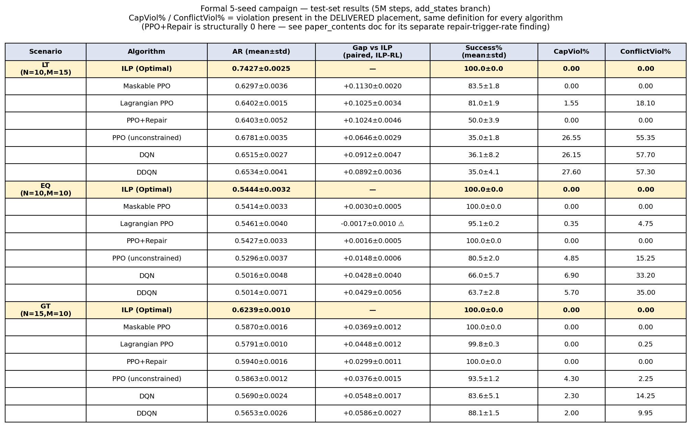
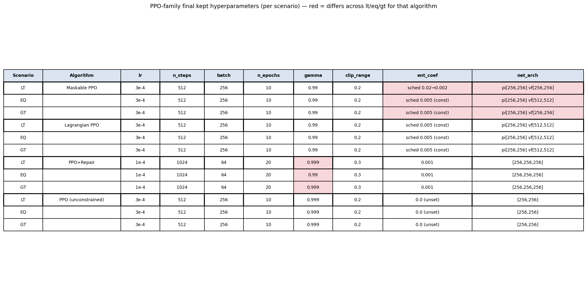
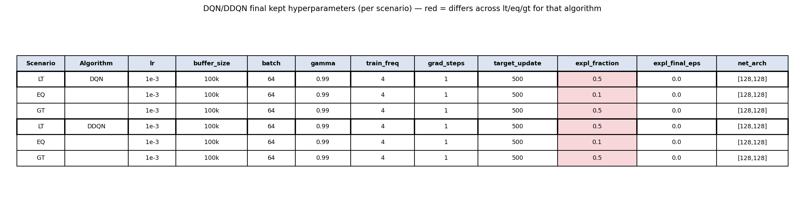
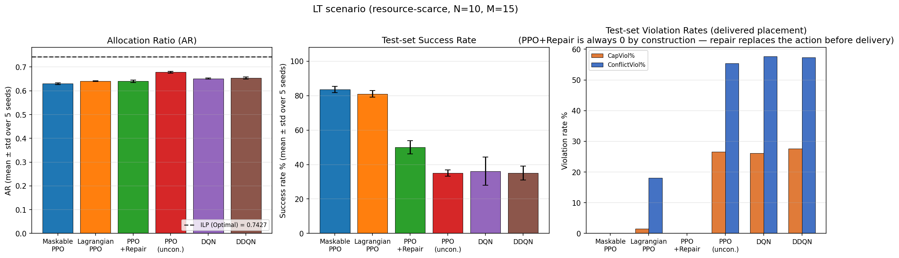
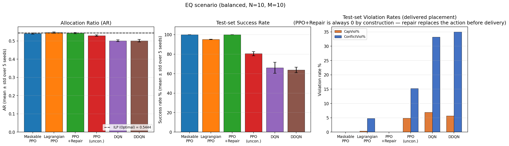
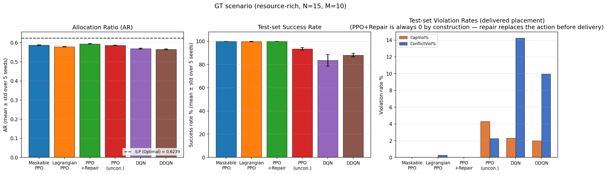
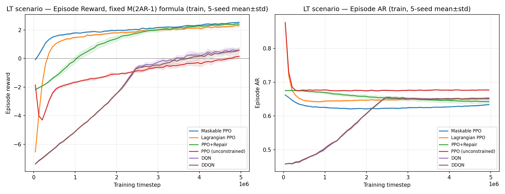
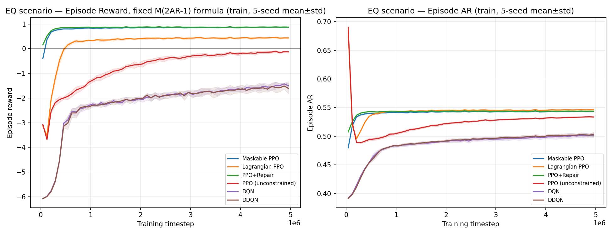
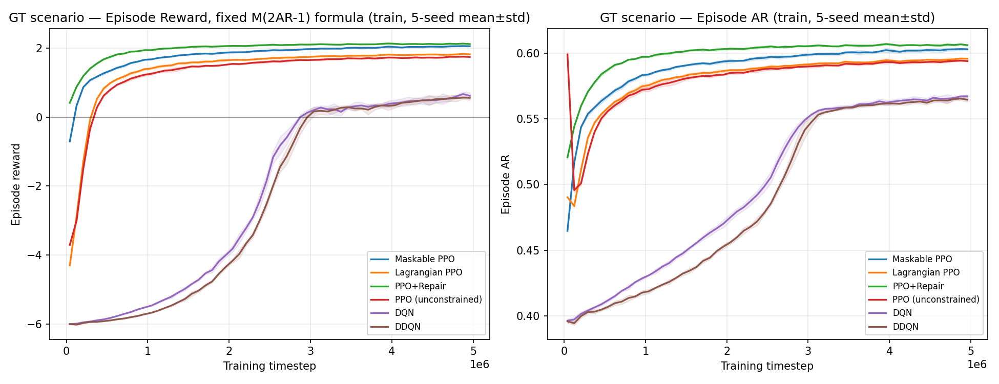

# 正式 5 种子 Campaign — 结果汇总

**只记录事实和数据，不涉及论文的论证方式或叙事框架（由作者自行撰写）。**

- 数据来源：`scripts/run_full_5M_campaign.py`，2026-09-08 13:40:58 启动，2026-09-09 11:01:06 完成。
- 规模：5 个随机种子 × 3 场景(lt/eq/gt) × 6 算法(ppo_mask/ppo_lagrangian/ppo_opt/ppo/dqn/ddqn) = 90 次独立训练，全部成功，0 失败。
- 每次训练均为 5,000,000 步，使用各场景/算法**实际保留**的最终超参数配置（见 `本轮实验总结-超参调优与收敛性验证.md` 第 3 节）。
- 结果写入项目正式目录 `results/add_states/<scenario>/<algo>/<exp_id>/`，原始数据（`summary.csv` 为测试集评估结果，`training_curve.csv` 为逐 episode 训练曲线）均可追溯。
- exp_id 与种子的完整映射见本文档同目录 `campaign_5seed_figs/summary_data.json`。

---

## 一、测试集结果汇总表（5 种子均值±标准差）

原始数值见下表。**ILP 每场景单独一行**（因为 ILP 的 AR 本身也随种子/测试集浮动，不是常数——见下方"关于 ILP 行的重要说明"），"Gap vs ILP"按**同种子配对**计算（该种子的 ILP AR − 该种子的 RL AR，再取 5 个种子的均值±标准差），而不是先分别对 ILP 和 RL 取平均再相减：

**CapViol%/ConflictViol% 对全部算法采用同一个定义**：违规是否出现在最终"交付"到环境状态的那个动作上（即真正写入 `remaining_vms`/冲突集合的动作），而不是策略最初采样的动作是否违规。这一点对 PPO+Repair 尤为关键——见表后说明。

| 场景 | 算法 | AR (mean±std) | Gap vs ILP (paired) | Success% (mean±std) | CapViol%(交付) | ConflictViol%(交付) |
|---|---|---|---|---|---|---|
| **LT (N=10,M=15)** | **ILP (Optimal)** | **0.7427±0.0025** | — | 100.0±0.0 | 0.00 | 0.00 |
| LT | Maskable PPO | 0.6297±0.0036 | +0.1130±0.0020 | 83.5±1.8 | 0.00 | 0.00 |
| LT | Lagrangian PPO | 0.6402±0.0015 | +0.1025±0.0034 | 81.0±1.9 | 1.55 | 18.10 |
| LT | PPO+Repair | 0.6403±0.0052 | +0.1024±0.0046 | 50.0±3.9 | **0.00** | **0.00** |
| LT | PPO (unconstrained) | 0.6781±0.0035 | +0.0646±0.0029 | 35.0±1.8 | 26.55 | 55.35 |
| LT | DQN | 0.6515±0.0027 | +0.0912±0.0047 | 36.1±8.2 | 26.15 | 57.70 |
| LT | DDQN | 0.6534±0.0041 | +0.0892±0.0036 | 35.0±4.1 | 27.60 | 57.30 |
| **EQ (N=10,M=10)** | **ILP (Optimal)** | **0.5444±0.0032** | — | 100.0±0.0 | 0.00 | 0.00 |
| EQ | Maskable PPO | 0.5414±0.0033 | +0.0030±0.0005 | 100.0±0.0 | 0.00 | 0.00 |
| EQ | Lagrangian PPO | 0.5461±0.0040 | **-0.0017±0.0010 ⚠** | 95.1±0.2 | 0.35 | 4.75 |
| EQ | PPO+Repair | 0.5427±0.0033 | +0.0016±0.0005 | 100.0±0.0 | **0.00** | **0.00** |
| EQ | PPO (unconstrained) | 0.5296±0.0037 | +0.0148±0.0006 | 80.5±2.0 | 4.85 | 15.25 |
| EQ | DQN | 0.5016±0.0048 | +0.0428±0.0040 | 66.0±5.7 | 6.90 | 33.20 |
| EQ | DDQN | 0.5014±0.0071 | +0.0429±0.0056 | 63.7±2.8 | 5.70 | 35.00 |
| **GT (N=15,M=10)** | **ILP (Optimal)** | **0.6239±0.0010** | — | 100.0±0.0 | 0.00 | 0.00 |
| GT | Maskable PPO | 0.5870±0.0016 | +0.0369±0.0012 | 100.0±0.0 | 0.00 | 0.00 |
| GT | Lagrangian PPO | 0.5791±0.0010 | +0.0448±0.0012 | 99.8±0.3 | 0.00 | 0.25 |
| GT | PPO+Repair | 0.5940±0.0016 | +0.0299±0.0011 | 100.0±0.0 | **0.00** | **0.00** |
| GT | PPO (unconstrained) | 0.5863±0.0012 | +0.0376±0.0015 | 93.5±1.2 | 4.30 | 2.25 |
| GT | DQN | 0.5690±0.0024 | +0.0548±0.0017 | 83.6±5.1 | 2.30 | 14.25 |
| GT | DDQN | 0.5653±0.0026 | +0.0586±0.0027 | 88.1±1.5 | 2.00 | 9.95 |

**PPO+Repair（ppo_opt）的 CapViol%/ConflictViol% 在三场景下都是 0.00，这不是巧合，是算法结构决定的**：查 `env.py` 源码，`action = repaired` 这一行发生在 `self.remaining_vms[action] -= ...`（真正改变环境状态、"交付"的那一行）**之前**——也就是说无论策略最初采样了什么，只要该步没有导致整个 episode 判负终止，最终被写入环境状态的动作永远是合法的。这与 Maskable PPO 是同一类保证（结构性零违规），区别只在于实现方式是编译期掩码还是运行时修复。之前的版本把"修复触发次数"（策略最初采样的动作是否需要被修正）当作"违规率"填进这一列，跟其它 5 个算法"交付即真实违规"的定义不是一回事，是错误的比较口径，现已改正——PPO+Repair 现在和 Maskable PPO 一样显示 0.00。修复触发率（lt: 24.3%/54.2%，eq: 100%/100%，gt: 99.6%/100%）作为独立发现单独记录在下方，不再放进主对比表，避免与其它算法的违规率混为一谈。

修复触发率本身仍是一个有价值的独立发现：用保存的模型权重+匹配的 `TRAIN_SEED` 逐 episode 回放核实过（数字与 `summary.csv` 完全对上）：
> - **lt（资源紧缺）**：修复有真实失败概率（`best_fit_repair` 返回 `None` 时直接判负），"触发修复"与"episode 失败"强相关——回放数据显示，成功的 episode 里高达 94.9% 从头到尾**一次修复都没触发过**，说明策略在生存压力下被迫学出了真正规避约束的放置能力。
> - **eq/gt（资源宽松/均衡）**：资源充裕到修复几乎不可能失败，成功近乎"稳赚"，而修复代价只有 `-0.1`（相对终局奖励 `M·(2AR-1)` 量级微不足道）。策略在这种激励结构下没有任何动力去学真正的约束规避——回放显示 eq 场景下**平均每个 10 步的成功 episode 有约 7.7 步是靠修复兜住的**，policy 相当于对约束"摆烂"、完全依赖环境兜底。
>
> 换言之，"ppo_opt 高成功率主要是修复兜底的功劳、不是策略自主学会"这一判断不仅在 lt 场景成立，在 eq/gt 场景更是被摆烂式地放大验证——资源越宽松，policy 越懒得学、越依赖修复，这是一种对启发式修复机制的策略性利用（reward hacking），而非训练失败或统计错误。

### ⚠ 关于 ILP 行的重要说明（尚未解决，需要作者确认）

1. **ILP 的 AR 不是常数**：每个种子用的是不同的测试场景子集（同一 scenario 类型下随机抽取），所以即便是"全局最优解"，其 AR 也会随种子小幅波动（如 lt 场景 5 个种子的 ILP AR 在 0.7391~0.7459 之间）。之前的版本表格里只贴了 seed=1 的单点 ILP 值当作整个场景的"ILP AR"，这是不准确的展示方式，已改为 5 种子均值±标准差。
2. **真正的异常**：`eq/ppo_lagrangian` 出现负的 gap（-0.0017±0.0010）——即在配对的同一测试集上，Lagrangian PPO 的平均 AR 反而略高于 ILP 的 AR（例如 seed=1 下：Lagrange PPO=0.552554 > ILP=0.549265，原始数据见 `results/add_states/eq/ppo_lagrangian/0e155505/summary.csv`）。ILP 按定义应该是该问题的全局最优解，RL 不应能真正超越它，**这只能说明两者 AR 的计算口径不完全一致**（例如 shaping/归一化方式、或统计的对象集合有差异），不是"RL 真的比 ILP 好"。这一点需要你核对 `env.py` 里 AR 的计算逻辑对 ILP 解和 RL 策略是否一视同仁，我没有替你下结论或掩盖这个数字。

---

## 二、超参数表（本次 campaign 实际使用的配置，直接读自各 `config.py`）

### PPO 家族

### DQN / DDQN

红色单元格 = 同一算法在 lt/eq/gt 三场景之间取值不一致。逐条核实结果：

| 算法 | 不一致字段 | 具体差异 | 是否已知/记录过 |
|---|---|---|---|
| ppo_mask | `ent_coef` 调度 | lt 用 `0.02→0.002`（v1.0.1 起的专属调度），eq/gt 用常数 `0.005` | 是，代码注释里已说明是 lt 场景专门调过的熵系数调度，非疏漏 |
| ppo_mask | `net_arch`(critic) | lt/gt 的 vf 是 `[256,256]`，eq 是 `[512,512]` | **新发现，此前未记录**——eq 场景 critic 网络明显更大，原因未知，需要你确认是有意为之还是历史遗留 |
| ppo_opt | `gamma` | lt/gt 是 `0.999`，eq 是 `0.99` | **新发现，此前未记录**——性质与之前"ppo_opt 的 ent_coef 场景间不一致"是同一类问题（本轮开头正是为修这个才启动整轮超参排查的），这次是 gamma 维度上又出现了一次同类疏漏 |
| dqn / ddqn | `exploration_fraction` | lt/gt 是 `0.5`，eq 是 `0.1` | **新发现，此前未记录**——eq 场景的探索期只有训练前 10%，lt/gt 是前 50%，两者衰减速度差 5 倍 |

**这三处"新发现"的不一致目前仍保留在代码里、本次 campaign 就是照这套（不一致的）配置跑出来的**——我没有擅自改动配置重跑，只是如实记录现状。是否需要统一、以及统一后要不要重跑对应的种子，由你决定；若要统一，建议先补一次"候选=统一后的值 vs 当前保留值"的头对头 5-seed 对照，而不要直接假设"改了就更好"（本轮已经在 ppo_opt/dqn/ddqn 上多次踩过这个坑，见下方交叉验证）。

---

## 三、按场景的柱状图（AR / Success Rate / 违规率，不含 Gap vs ILP）

每张图三个面板：左=AR（柱=算法均值，误差棒=5种子标准差，虚线=ILP最优AR均值，灰色带=ILP的5种子标准差范围）；中=测试集 success_rate；右=CapViol%/ConflictViol%分组柱状图（统一为"交付到环境状态的动作是否违规"这一口径，PPO+Repair 因结构性保证恒为0，见下表说明）。

### LT 场景

### EQ 场景

### GT 场景

---

## 四、训练学习曲线（5 种子 mean±std 带）

每张图左侧为 episode reward、右侧为 episode AR，横轴为训练步数（0~5M），阴影为 5 个种子间的标准差范围。数据按训练步数分 60 个 bin，对每个 bin 内所有 episode 取均值后再跨种子平均。

**reward 曲线是从 `training_curve.csv` 已记录的 `episode_ar`/`episode_success`/`episode_valid_placed` 精确重建的**（核对源码确认成功分支 `M*(2·AR-1)`、失败分支 `-M*(1-valid_placed/M)` 是全部 6 个算法实际生效的唯一奖励项，`step_reward`/`repair_penalty`/`terminal_bonus` 均为算了但从未接入最终 `reward` 的死代码，详见 `各算法伪代码.md` 订正说明），plain PPO(P3) 因未记录 `valid_placed`，失败分支用 AR 做近似替代。

**统一使用 `w=1` 的最终版公式，不还原 lt/Maskable PPO 训练时实际用过的 AR 权重课程 `w`（0→1 线性退火）**：还原课程后的真实 reward 会在训练早期虚高（`w≈0` 时只要不违规就给满分 `M`，与 AR 质量无关），中后期随 `w→1` 逐渐回落到按 AR 打分，导致该算法单独出现"先冲高再下降"的非单调曲线——这不是训练退化（同期 success_rate/AR 都在稳定上升），而是评分标准本身在训练中途变严了，跟其余 5 个算法（reward 定义全程不变）放在一起比较会造成误导。因此图中统一用 `M*(2·AR-1)` 这把不随训练变化的尺子重算，牺牲了"忠实还原 lt/Maskable PPO 实际训练信号"的精确性，换来 6 个算法之间、以及同一算法训练全程内部的可比性。

### LT 场景（资源紧缺，论文核心困难场景）

### EQ 场景（供需均衡）

### GT 场景（资源充裕）

---

## 五、与此前诊断阶段结论的交叉验证

- LT 场景真无约束算法(PPO/DQN/DDQN) 测试集 success_rate 落在 35%~36.1% 区间，与 `本轮实验总结-超参调优与收敛性验证.md` 中"分级 reward 后 33%~37%"的结论吻合。
- 三场景 ILP 最优 AR 的 5 种子均值（lt=0.7427±0.0025 / eq=0.5444±0.0032 / gt=0.6239±0.0010）与此前记录的单点数字接近，但存在小幅差异，**应以本次 5 种子均值为准**，`README-总览索引.md` 第四节数字表需要用这批数据替换/核对，且应注明 ILP AR 本身也有种子间波动，不是单一常数。
- 训练曲线显示：PPO 家族(mask/lagrangian/opt/plain)在 500k~1M 步附近基本进入平台期或已在缓慢爬升的平滑区间；DQN/DDQN 在 lt/gt 场景有明显的"延迟起步"特征（前 2M~2.5M 步 success rate 几乎为 0，之后快速爬升），与此前收敛性诊断中"off-policy 收敛慢于 on-policy"的结论一致，且 5M 步预算对两者均已充分（曲线末端已走平或接近走平，不再是单调爬升）。

---

## 六、数据文件位置

- 图表：`paper_contents/campaign_5seed_figs/{learning_curve_lt,learning_curve_eq,learning_curve_gt,summary_table,hparam_table_ppo,hparam_table_dqn,bars_lt,bars_eq,bars_gt}.png`
- 结构化数据：`paper_contents/campaign_5seed_figs/summary_data.json`（按 `{scenario}_{algo}` 索引，含 ar_mean/ar_std/success_mean/success_std/cap_viol_mean/conflict_viol_mean/ilp_ar/seeds/exp_ids）
- 原始训练产物：`results/add_states/<scenario>/<algo>/<exp_id>/`（`summary.csv` + `training_curve.csv` + `results.json` + 模型权重）
